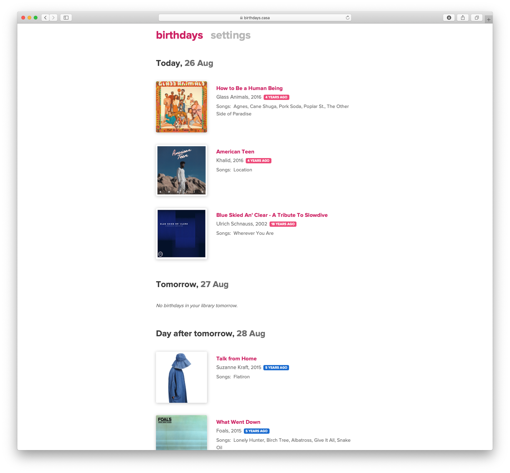

## album birthdays<i>!</i>

__album birthdays<i>!</i>__ is an app that can notify you on the release date anniversaries of titles in your music library. It works with Spotify and with Apple Music, via [scrobble](https://scrobbl.es).

Check it out at [https://birthdays.casa](https://birthdays.casa).

For a preview of an email notification, check out [an example email](https://birthdays.casa/email-preview).

The website also displays titles that have an upcoming release date anniversary.



## Develop

To develop locally you will need node, npm, [entr](http://eradman.com/entrproject/), and redis.

Install dependencies.

```
make deps
```

Start a redis server at `localhost:6379`.

```
./path/to/redis-server
```

Build & watch code. In separate terminals run the following.

```
cd appengine-go
make
```

```
cd web
make
```

Visit `localhost:8080`.

## Deploy

```
make all
make deploy
```

## Attributions

See ATTRIBUTIONS.md.

## License

MIT
